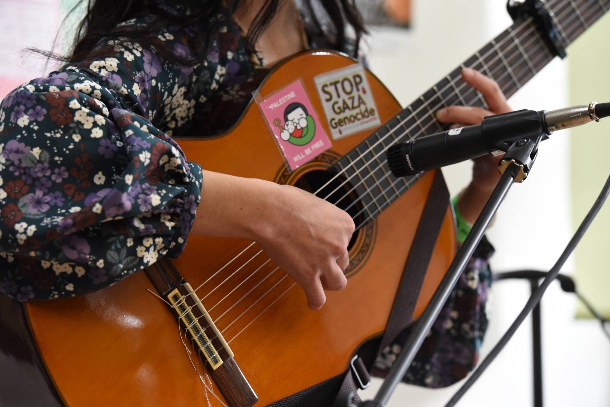

**さとレックス（以下さとレ）：** 少し基本的なところもお聞きできますか。アンナさんって、子供の頃どんな子でした？

**アンナ・マレェ（以下アンナ）：** ちょろちょろしている子でしたね（笑）。じっと座っているのが苦手で。チャイムの5分前になっても気づかないで、「なんでみんな校舎に向かって走っているんだろう」と思いながら遊び続けて、チャイムが聞こえてから「やべえ戻んなきゃ」みたいな。気まぐれで、わがままで、一貫性がない。今振り返っても、そういう子でしたね。

**さとレ：** 勉強と運動はどっちが得意でした？

**アンナ：** 運動は苦手でした。勉強は小学校の頃はまあまあいけたんですけど、中学で算数が数学に移った頃からわけわかんなくなって（笑）。

**さとレ：** 音楽を始めたのはいつ頃ですか？

**アンナ：** 活動を始めたのが2014年です。水戸ソニックの上にある参丁目劇場という、焼き鳥もカレーも美味しいライブバーみたいな小さなスペースがあって、そこでカラオケの音源に合わせてカバーを歌うところから、細々と始めていきました。
<!--more-->
**さとレ：** きっかけはあったんですか？

**アンナ：** あるバンドの追っかけをしていて、ライブハウスにはお客さんとして出入りしていたんですが、「自分もそっち側に行ってみたい」という気持ちもあって。楽器が弾けるわけじゃなかったので、「音源があればできるよ」という広告か何かを見て、出演をお願いしたのが最初です。

**さとレ：** これ、「やってみたいけどまだやっていない」人が勇気を出して始めるきっかけになる話だなと思って。すごくいいなと。

**アンナ：** 本当ですか（笑）。ありがとうございます。

---

**さとレ：** ギターを持つようになったのはいつ頃？

**アンナ：** 活動を始めてから、そんなに経たないうちです。2012年頃にアコースティックギターを買ったんですけど、弦が痛くて放置していたものを、2014年に活動を始めてからまた取り出してみたら面白くて。弾き語りをされている方が「難しいバレーコードじゃなく、楽な抑え方でも弾けるようになってきた」とお話されていたのが背中を押してくれたんです。

**さとレ：** クラシックギターに変えたのはどういう経緯で？

**アンナ：** 水戸で活動されていたしまだあすかさんというシンガーソングライターの方がSNSで青葉市子さんを紹介していて、見てみたらもうわっとなってしまって。青葉市子さんや、そのお師匠筋の山田庵巳さんがクラシックギターで表現されているので、私もクラシックギターにしたいと思って買いました。

**さとレ：** 弾き語りの界隈でクラシックギターを使う方って多くないですよね。アンナさんのスタイルにすごく合っていると思って、いつも聞いています。

**アンナ：** ありがとうございます。一概には言えないですけど、自分にしっくりくるかという点では、やっぱりクラシックギターなんだと思います。

---

**さとレ：** 参丁目劇場で初めて出た時のことって覚えていますか？

**アンナ：** 覚えています。めちゃくちゃ緊張しました。歌が好きだからある程度できるじゃん、と思っていたら全然できなくて。穴があったら入りたいくらいで。今で言う共感性羞恥ですよ、昔の自分を振り返って（笑）。

**さとレ：** 誰しも通る道ですよね。ラルクのhydeさんが初ステージのことを「怖くて、ひたすらマイクスタンドにしがみついて震えていた」と語っていたそうで。

**アンナ：** フレディ・マーキュリーも、あのステージでの素晴らしい動きは、震えをどうにか見せられるものにするために取り入れ始めたという話を聞いたことがあります。本当かどうかはわからないけど、あんなすごい人でもそうなのかと思って。

**さとレ：** 仕上がりだけ見ているとこの人は生まれてからこうなのかなと思えてしまうけど、その人たちにも最初の瞬間があって、怖くてしょうがなかった過去があるんだろうな、と。それに、ステージに立ったら1対1ですしね。どんな立場差があっても、どっちも個としての表現者になってフラットなところに来てしまう。

**アンナ：** 違うようで同じ、ということですかね。

---

**さとレ：** 僕は多分、静かに多動性のある子供でした。年子の兄のお下がりの教科書を1年前に読んでしまって、自分の教科書を配られた日に「もう読み終わってる」と思うの。で、授業を聞かずに鉛筆と消しゴムで一人「とりゃー」とかやって遊んでいるような子でした。通知表に「さとれ君はいっつも瞑想しています」と書かれたこともあって（笑）。

**アンナ：** 小学生にして瞑想（笑）。

**さとレ：** 理屈っぽいって言われることも多くて、運動もからっきしで、スクールカースト最下位みたいなんですけど、なんとなく「自分はこいつらとは違うんだぜ」みたいに思っている嫌なガキで（笑）。

**アンナ：** わかります……私もその気はあった気がするな。なんでそんなやつなんだろうって自分でも思うんですけど。

**さとレ：** でも子供って全員「自分が主人公だ」と思っているから、「俺だけは特別だぜ」はみんなそうなんじゃないかと（笑）。

**アンナ：** そう思いたい。そうですよね、きっとね。

---

**さとレ：** 音楽は小学校の合唱団や、父親の詩吟についていったりと、わりと早くから触れていて。上京して音楽学校に行って、バンドやりながらバイトしてという生活の後、30歳頃にプログラマーとして就職して、今に至ります。

去年ぐらいに気づいたことがあって。ボードゲームに「勝利点」という概念があるんですよ。これを集めた人が勝ち、というポイントで。自分の人生の勝利点って何だろうと考えたとき——結論として、「音楽をやる時間を最大化することが、勝利点の加算条件だ」と思ったんです。

**アンナ：** どういうふうにそこに辿り着いたんですか？

**さとレ：** キャリアを見直さなければいけないタイミングが一昨年ぐらいにあって。仮に収入が倍になっても音楽をやる時間がなくなりましたという境遇を幸せと思えるか……全然ダメだと思って。「音楽さえできればいいじゃん」と認めるまで、ちょっと恥ずかしさがあったんですけどね。仕事が二の次になるような気がして、認めにくかったんですが。でも嘘ついてもしょうがないと思って、そう決めてからは楽になりました。

**アンナ：** すごく素敵です。

**さとレ：** アンナさんご自身は、お仕事や生き方についてはどんな風に感じてこられましたか？

**アンナ：** ずっと迷い中ですね。ずっと逍遥しているような人生というか。こだわりは強い方だと自分では思うんですが、ちゃんとブレないものを持っているかというとそうでもなくて。決断してもその後「本当にこれでよかったのかな」とずっと考えてきた気がします。

**さとレ：** 自分のことをわかっている人って、基本的にはほとんどいないんじゃないかなと思っていて。それでもどこかで自分と折り合いをつけてやっていくのが、スタンダードな生き方なのかなと思っていますが。

**アンナ：** そうですね。全部大事だなと思う中で迷うこともあって。例えば発する言葉一つで、何がこの世界に伝播していくかが変わる。だから舞台の上でも日常でも、これは言うべきか言わざるべきかって、小さな段階からいつも迷っています。行動に起こしてしまった後でも、迷ったりする。

**さとレ：** 迷い続けていく感じ、ですかね。

**アンナ：** そうですね。まだまだ迷い続けていくのかもしれないです。

---

[*第3話につづく*](../03/index.md)
