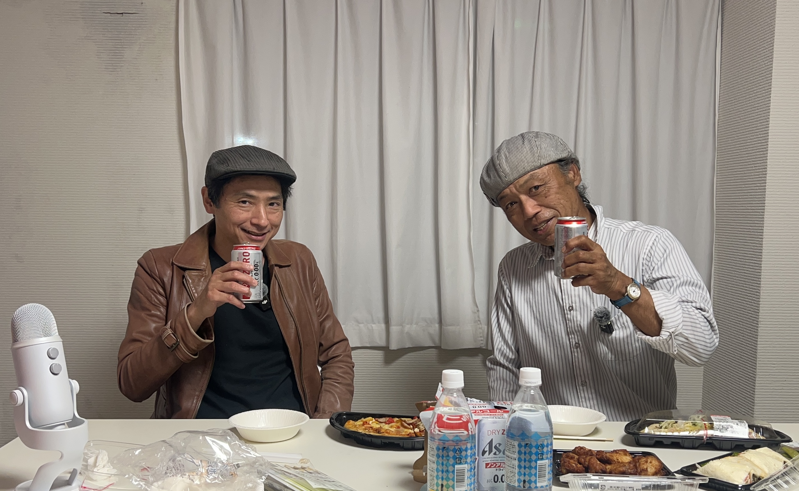

**さとレックス（以下さとレ）：** もう回ってるから、取材のていでしゃべりながら……

**geru（以下geru）：** ありがとうございます。よろしくお願いします。

**さとレ：** このウェブマガジンのコンセプトは、打ち上げをミュージシャン同士でやりつつ、読者がそこにこっそり居合わせるような感じで間を覗き見てもらうっていうものでして。なので、打ち上げをイメージしてノンアルですがお酒とつまみをご用意しましたよ。

**geru：** お酒やめられない歌を歌ってるんですけども、年間通じてお酒飲んでる日ってほぼないですから。2、3日あるかないかぐらい。

**さとレ：** 健康的ですね。

**geru：** この間東京のフェスで朝から終電になるまで飲みまくってたのが、今年一番飲んでるかもっていうくらい。太ももが痛い。（笑）

<!--more-->

**さとレ：** へえ、それはどんなフェスだったんですか？

**geru：** 渋谷の道玄坂界隈のライブハウス何件かで回るサーキットだったんですけど。あの、ライブでもなければもう道玄坂っていう町には行きたくないです。山登りですよあれ、坂じゃない。あんな急な坂、東京にあるんだとびっくりしました。こっちは重いギター持ってるわ、物販セット持ってるわ、両手塞がってきついんですけど、と思って。

**さとレ：** 確かにあそこは……。

**geru：** ありがとうございます。なんか幸せに暮らしております。ライブの本数だけ、本数分楽しいです。

---

*[第2話へ続く](../02/)*
