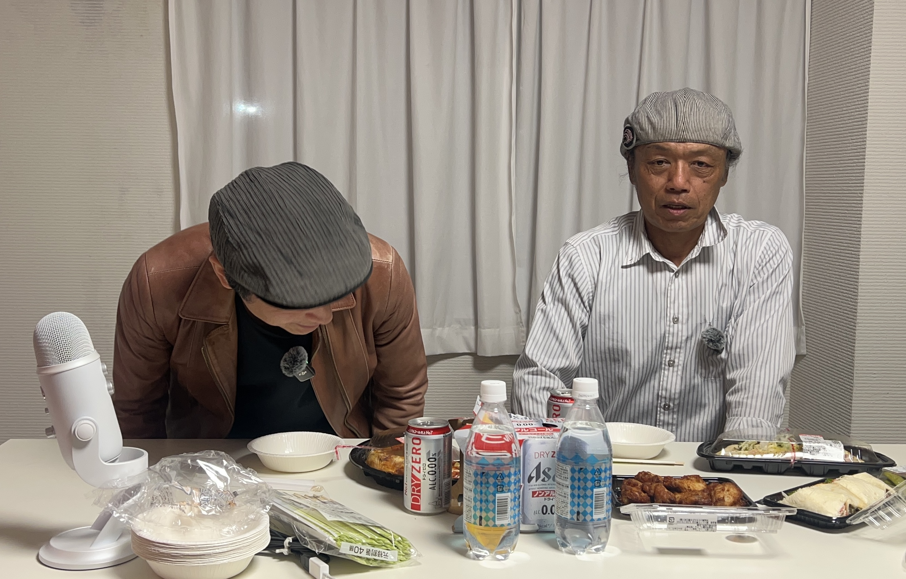

**さとレ：** 幼少のみぎりの頃ってどんな子供だったんですか？

**geru：** 僕は今こうやってうるさいからちょっと黙っててくださいって言われるぐらいしゃべれるんですけど、実は人見知りで無口な子だったんですよ。えっと僕は5人兄弟の一番末っ子なんですけど、すぐ上の兄ちゃんでも11個離れてるんですよ。でおふくろがあの農家だったんですね。田んぼとか畑に僕をおぶって、赤ちゃんの時連れてって、今のワードで言うと……放置プレイっていうか。

**さとレ：** 寝かせっぱなし？

**geru：** ネグレクトっていうんですか。親には世話になってるんだけど全く無視された毎日みたいな。

<!--more-->

**さとレ：** かまってもらった覚えがない、思い出がない。

**geru：** そうそう。だから、そういう口に出ない子の特徴らしいんですけど、泣いても誰も来ないから喋らなくなるらしいんですよ。で、もう泣かない子ですよ、だから。物を言わないし、人に会うとじーっと見てるっていうか、もしくは目線を外して下だけ見てるみたいな……暗い子でした。

今でもそういう人間は変わってなくて、人付き合いが自分では苦手だと思っていて、照れ隠しでめっちゃ喋っちゃうんですよ、こうやってね。

**さとレ：** へぇー。

---

**さとレ：** 小学校の頃はどういう遊びが好きだったとか、これは得意だったよとかってありました？

**geru：** 得意なもの……どんくさいんで、体育は反射神経だけまあ人並みぐらいなんですよ。誇れるものはギブアップしない競技だけ大丈夫なんですよ。例えばマラソン、足は速くないんですよ。だからマラソン「得意」って言っちゃったけど、順位で言うと全然後の方なんですよ。なんですけど、完走すりゃいいんじゃん、みたいな感じで。

**さとレ：** あの僕も運動全般ダメだったんですけど、持久力系だけはまあなんとか。50メートル走とかは結構遊んでんのって言われるぐらいだし、ボールスローも全然前に飛ばなくて。だけどマラソン大会はじーっと我慢してると、あれだけ速かった友達がちょっと……

**geru：** そうそうそう！へたって遅れていくんですよね。

**さとレ：** 我慢さえしてればまあそこそこのところに行くんだなと思って。

**geru：** だから一等賞取ったこともないし、順位で言うと真ん中より下なんですけど、集中力を欠いた子たちを何人か抜いちゃったごめんねみたいな感じですね。俺すげえなどやっていう感じは一度もないんですけど。そう、我慢してればなんかビリにはならないんだみたいな競技のあれが好き、好きっていうか一応辛いから嫌いなんですけど、でもなんかそんなに不得意なものではなかったんですね。

---

**さとレ：** 中学に入られてから部活とかされました？

**geru：** やってましたサッカー部。だけどねサッカー部はもうトラウマです。サッカーは見るのは大好きなんですけど、今やろうって言われてもやりたいって言えないです。ずっと左利きなんですけど、クラブの中で左利きが僕しかいなくて。中学校の時、左ウィングなんですよ。

左サイドをずっと走ってたんですよ。上がったり下がったり、運動量がフォワードさんより一番多いのかも、っていうポジションが辛くて。2時間走りっぱなしやんけ俺だけ、みたいな。あーもうサッカー嫌いだ俺はーってずっと思ってました。

「お前はライン際の男だろ、ライン際だお前は」って言われてましてね。はい、そういう時代だったんですね。（笑）

**さとレ：** なるほどな。

---

*[第3話へ戻る](../03/)　|　[第5話へ続く](../05/)*
