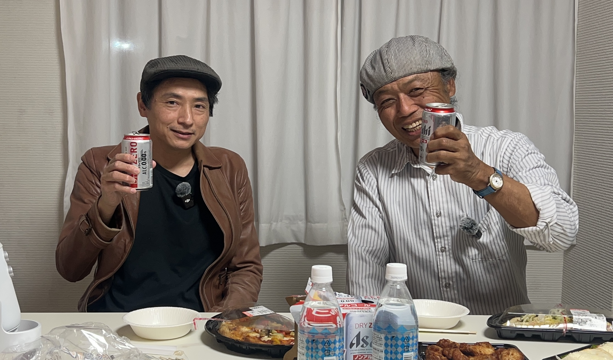

記録の話になった。さとレが「記念」という言葉について話しはじめる。

**さとレ：** 最近ふと気づいたのが、やっぱりそういう写真とかってあると急に思い出せたりするな、その時のことを。「記念」って言葉、あるじゃないですか。全然ピンときてなかったんですけど、「念に記す」っていうのは、 あれは「思い出す紐をつける」ってことなんだと思って。その紐があればスルスルスルって取れるんだけど、紐のなくなっちゃった思い出っていうのは、あるのに沈んでしまって取り出せないっていう状態なんだなって。

**geru：** ですよね。僕もブログとか、続かないんですけど。三日坊主どころか……

**さとレ：** いつ書いていつ辞めたんだかもう分かんないけど、長続きしてる人すごいなって本当に思います。

<!--more-->

**geru：** 日記続けてる人、すごいですよ。前にね、日記ずっと続けてらっしゃる方に聞いたことあるんですよ。「毎日書けますか？」って言ったら、「書いてるよ。毎日同じだっていいんだよ、それが記録だから」って。

**さとレ：** おー。

**geru：** 「毎日同じだって、変わったことそんなにないよ。だけど、『昨日と今日変わりません』みたいな文章でもいいんだよ。変わりないんだから、それが記録なのよ」っておっしゃったんですよ。「あーなるほどなー」と思って。

「じゃあそれって誰に見せるんですか？」って言ったら「何言ってんの、人に見せるものじゃないよ」って。「なんだったら書いてる私自身も二度と見ないかも。でも時々ね、暇な時に、『何年か前、私何やってたかしら？何考えてたかしら？』と思ってパラパラっと見ることあるけれど、ティッシュの紙一枚一枚重ねるような日々かもしれないけど、何年か前の自分よりはちょっとぐらい前に進んでるなって分かるよ」っていう感じだったりとか。続けてらっしゃる人の言葉って本当重いなと思って。「人になんか絶対見せないけど」……そうか、見せない前提だから書けんのか、と思って。

---

技術の話に戻る。geruがプリンセスプリンセスの再結成ライブ映像を前夜見て感動した話をしはじめた。

**geru：** 昨夜感動して泣きながらプリンセスプリンセスの再結成動画を見てたんですよ。YouTubeに誰かが上げてたやつで。

ベースの渡辺さんがいるじゃないですか。ドラムさんがコンパクトにシンプルなプレイをやってるんだけど、ベースさんが絡むから2人で抑揚が生まれるっていうか、味付けがそこの二人でできちゃうっていうか。キックに合わせてバーンって入れた時にそこで抑揚がつくような、ベースがドラムさんを包み込むような……そのかっこよさをしれっとしてやってるところがすごくかっこいいと思って。

**さとレ：** なるほどね。

**geru：** 今さとレさんが言ってたこととまさに一緒だと思って、ちょっと乗っちゃいました。いや本当に、奥底がものすごい深いんですよね。

---

さとレが実は対バンでプリプリを見たことがあると明かした。

**さとレ：** ちょっとオフレコな感じで……プリプリのライブはワンマンじゃなくて、対バンで見たんですよ。TMネットワーク、米米クラブ、プリプリ、あとユニコーンだったかな……そんな感じのイベントで。

**geru：** うわサイコーじゃないですか。

**さとレ：** でプリプリが出ててMって名曲じゃないですか。イントロ出た瞬間にお客さんわーって盛り上がって。でBメロあたりからちょっとあれ、様子おかしいなって。最後のBメロの、「かなわない思いなら——」のくだりの歌詞が飛んで、なんかこうスキャットで歌うような感じになってザワザワっとして。

**geru：** あ、でもライブ終わりのMCで「私がとちっちゃったごめん」って入ってましたよ、確かに。

**さとレ：** そうそう、「大ミスをやらかした奥井香織でした」みたいな感じでメンバー紹介して。なんかねあの「おい！」っていう感情の会場の空気が、ちょっと面白かったんですけど。でも半年後にワンマンやります、ってその時に言ってて。

**geru：** あの5人ってやべえなと思ってちょっと感動しちゃったんですよね。一本の映画見たような感じで。本当に素晴らしかった。みんなで助け合ってやってる感じが美しかったです。はい。

---

音の止め方の話に移る。

**さとレ：** 師匠に教わったことの一つに、「音の止め方にもいくつかあるよ」ということを教わって。バシッと止めるのと、ドンって置いていくのと、ニュアンスが違うんだっていうことを聞いて。

音の立ち上がりが鋭ければびっくりする音になる。で止まる方もドシッって急激に止まると、人が驚くサウンドになるわけです。ブレイクの時とかはドシッていう止め方をしてあげると、そこまで続いてきた勢いが……音が止まって崖になるとして、気持ちはそのままの勢いで空中まで行くんで。それに対して、ドンって軟着陸で音を置いてあげると終わる感じになる。

**geru：** わかる（笑）マジですごい楽しいこの話。あの……ちょっと話取っちゃっていいですか？

---

**geru：** 僕歌も歌うじゃないですか。で、名前は出せないんですが、とある大先生がおっしゃったことなんですけど。「今時のミュージシャンで最近流行りなのは、口開きっぱなしだな、みんな歌い手が」って。「どういうことですか先生？」「口って閉じるから滑舌なんだよ。歌うたいの人は歌うから口開けて歌えばいいと思ってる人が大半すぎる。ちゃんと口を閉じることもしないと、言葉が繋がっていかない」ってその大先生がおっしゃったらしくて。

いや、ごもっともと思って。我々が今ベース談義をしていたのはそれですよね。ベースでいう滑舌なんですよ、多分。メロディーやリズムをはっきり主張させたいから、ブツッと切ったり、ボンと伸ばしたり、出た瞬間止めてしまったりする……それ、ベースでいう滑舌なんですよね。

**さとレ：** そうですね確かに。

**geru：** 今理解しました。（笑）

---

*[第7話へ戻る](../07/)　|　[第9話へ続く](../09/)*
