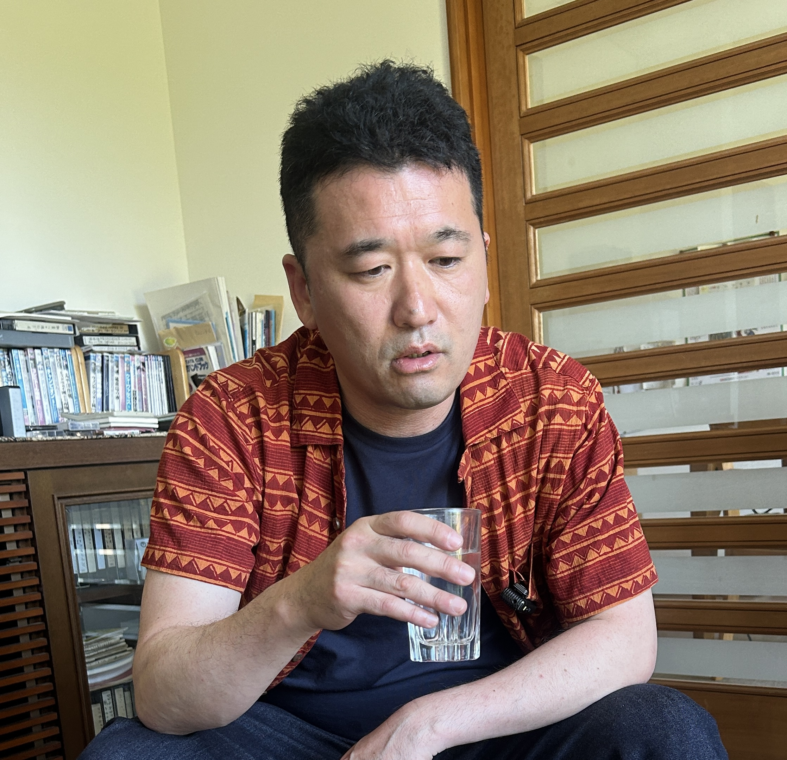

**小川周二（以下周二）：** ちょっと体調崩して入院してたじゃないですか。その3ヶ月間、家族以外とは人と離れて生きてたんだけど、帰ってきたら何か不思議な感じがあって。

<!--more-->

**周二：** 世の中って、こんなに優しかったっけって。今まで世界と乖離して、帰ってきたみたいな。今までとは違うなと思って。

**さとレックス(以下さとレ)：** 90EASTの[江原さん](https://x.com/mito90EAST)、心配してたよ。僕に電話くれた。

**周二：** さとレックスとか江原さんとかが優しいっていうのはそうだと思うんだけど、世界全般そうみたいな感じなんだ。例えばローソンに行ったら店員がめっちゃ優しいみたいな感じなんだ。知らないからわかるんだけど、どこに行ってもそういう感じが来てしまう。

**さとレ：** それは周二くん自身が優しくなったからじゃないの。

**周二：** そうなのかも。……自分が優しいと世界が優しく見えるっていうのは確かにそうなんだけど、それにしてもって感じはあって。

**さとレ：** あのゲームのさ、ドラクエとかあるじゃん。あれの主人公って、常に画面の真ん中にいてさ、移動する時は画面の方がスクロールしていくじゃん。で、自分の感覚っていうのも、自分にとっては常に普通のことをしているように感じられる。 「なんか周りが景色が変わってきたな」と思ったら、それは自分が動いたからじゃない？

**周二：** そうなんだよね。でも俺の感覚としては、変化が急で断層が感じられちゃうんだよね。厳しめの世界から優しめの世界に、パラレルワールドをポーンって移った感じがしたの。えーっ？て感じがするんだよ。

**さとレ：** それは壮大なドッキリで、周二君が入院してる間に僕がローソンに行って、「これから周二くんて人が来るから優しくしてあげて」って言ってきたんだよ。

**周二：** そうそう、そんなイメージ。優しく接してくれるんだよね、みんな。気のせいだと思うんだけど、なんかそういう錯覚に陥ってしまう。

*[第2話につづく](../02/)*
