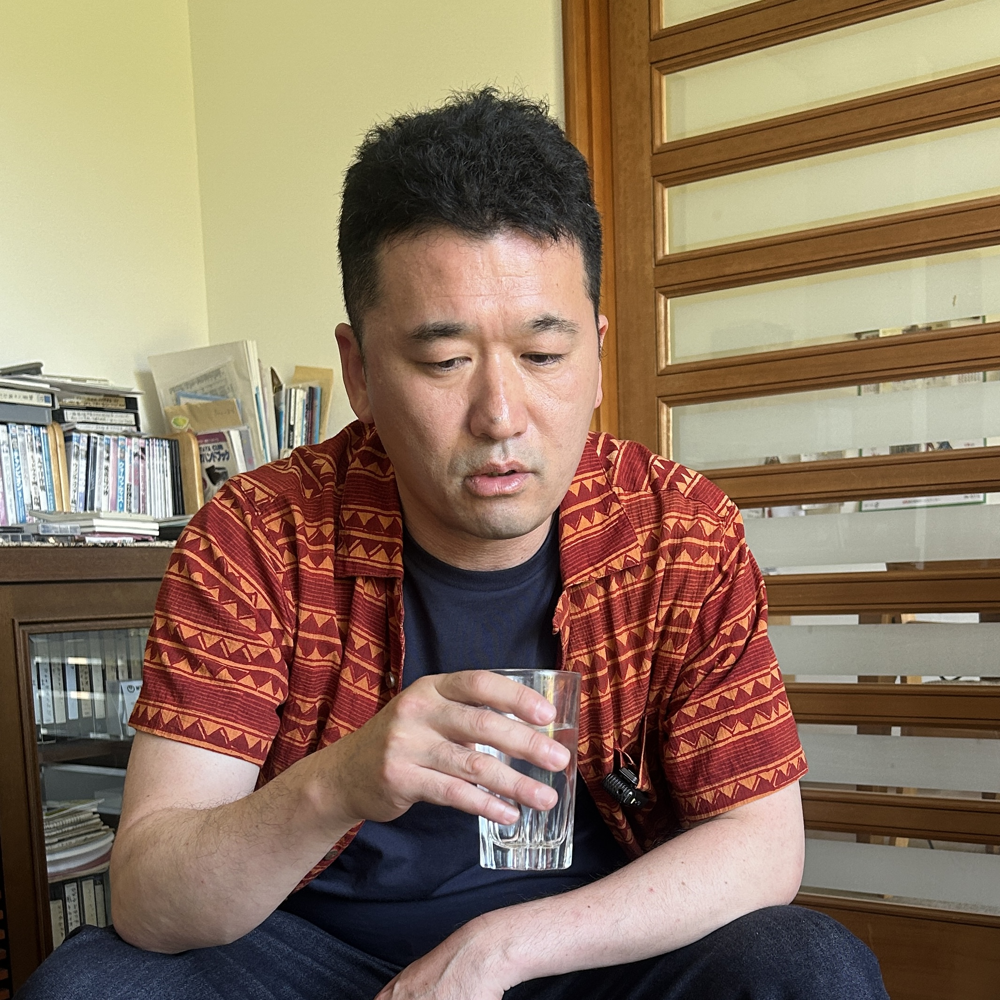

**小川周二（以下周二）：** 沖縄でアメリカ人の旅人と話したんですよ。大学時代にアメリカを巡っていたって言って。ニューヨークの人たちは特にセルフィッシュだったと言ってて、田舎に行くにつれて様子が違ってくるのを感じながら旅をしたと。それを聞いて、アメリカの田舎に行って音楽なりで表現してみて、何かが得られればと思ったんですよね。

<!--more-->

**さとレックス(以下さとレ)：** アメリカって建国以来ずっとある矛盾をそのまま抱えながら、矛盾の中に妥協点を見出し続けてきた国だと思う。黒人の話で言えば、ルーツをアフリカから引き離されて喪失を抱えながら生きてきた。それでも、そのまじりあったものとして、ブルースやジャズが生まれた。矛盾をそのまま抱えながらみんなが生き続けてきた国というのがある。

**周二：** アメリカって結構、州によって法律の違いとかもあるよね。

**さとレ：** そう、キリスト教ではチャーチという、地域に根ざした宗教コミュニティがあって、考え方の違う人間と同じ地域で生きていかなければならない。一方でセクトという思想で繋がるグループも同時にあって、違う考えの人間は出ていけばいいという発想になりやすい。アメリカの連邦主義の緊張関係ってそれに似てると思う。

**周二：** なんかそういう意味では日本とは見え方が違うよね。

---

**周二：** 沖縄ってなんか面白い場所だなと思って。平和ってのを考えるのに適した場所なんかなと思った。米軍のベースもあって、ライブハウスに来て一緒に沖縄の人と演奏したりもするらしくて。英語的、アメリカ的なものと、日本的なものと、琉球の要素がミックスされてるんだよね。そこになんか沖縄の懐の深さ、奥行きみたいなのを感じる。

---

**周二：** リベラルの人たちが言うのって、「平和は俺たちだけが守った」ってことになってるじゃないですか。他人を悪者にして争う時点で、ちょっと平和からズレてると思う。「みんなで一緒に平和になりたい」って言った方が、平和のイメージに近いじゃないですか。矛盾してるんだよね。

**さとレ：** 矛盾してるよね。

**周二：** 難しいんだよ。でもそれを言葉じゃないと説明できないから、さらに難しい。

*[第5話につづく](../05/)*
