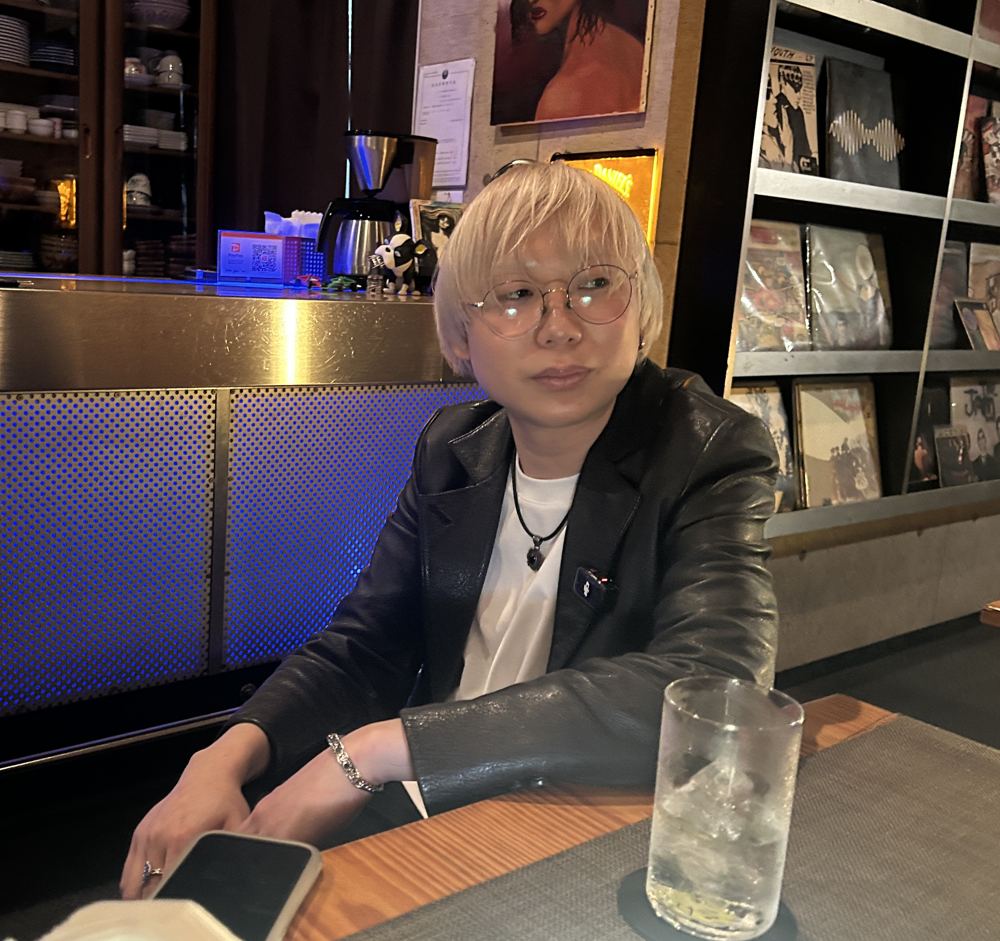

**さとレックス（以下さとレ）：** 今日のゲストはレオズ・ライブバーのマスター・キョウタさんです。よろしくお願いします。

**浦上キョウタ（以下キョウタ）：** よろしくお願いします。

**さとレ：** キョウタさんは、もともと池袋のアダムで仕事されてましたよね？

**キョウタ：** 一応、経歴から話しますと。ライブハウスに通い始めたのが18歳ぐらいで、そこからずっとライブハウスで働いていて。最初は柏のライブハウスで働いて、いろいろあって池袋のアダムに。その時によく出てた場所で2年ぐらいいたんですけど、その2年が結構濃くて。その後もいろいろあって、「レオズやらない？」ってなって、「やる」って。いつか自分の店は持ちたかったので、もう勢いで土浦に辿り着きました。

**さとレ：** なるほど。では皆さんにわりと聞いているところなんですが——キョウタさんって、どんな子供でした？

**キョウタ：** 子供。あー、小さい時の話か。何歳ぐらいとかあります？

**さとレ：** 覚えてる限り、ちっちゃいところから。

**キョウタ：** ははは。僕は千葉県の柏生まれ・柏育ちなんですけど、なぜか3歳まで高円寺で育つっていう。

**さとレ：** へぇー。

**キョウタ：** なんかあったらしくて。で、その時に筋肉少女帯の大槻ケンヂさんとかが高円寺を歩いているところに遭遇してたりするらしくて。もうその時からサブカルの血みたいなものがあったのかなと思って。0歳から3歳まで高円寺にいて、それから千葉の柏に戻ってきて、ずっと柏で育ちました。

<!--more-->

---

でも、めちゃくちゃおとなしかったって言われますね。デパートとかで親から「ここから離れないでね」って言われると、そこから離れなかったらしいです。かといって、別に人に声かけたり泣いたりするわけでもなく、ただどんどん寂しくなっていって、すごく悲しい顔してたっていうのを聞きました。

**さとレ：** 僕もそれ、ちょっとだけ思い出がありますね。スーパーで「ここ動かないでね」って言われて、じっと動かない。でも僕は泣いてたと思いますけど。しくしく。

**キョウタ：** 僕はそれでも泣かなかったらしくて。そういう意味で、静かな性格だったみたいで。

---

**さとレ：** 物心ついてからは？

**キョウタ：** 小学校・中学校とかは結構活発でした。めちゃくちゃ友達がいたとかじゃなかったんですけど、今思うと結構異常なことをしていて。昔って、学校の連絡網みたいなのあったじゃないですか？ あれ、男子全員に電話かけてましたね、マジで。

**さとレ：** 回すのではなく、「俺が全部かける！」みたいな感じですか。

**キョウタ：** だから誰とでも遊んでたみたいな感じで。今思うとちょっと変わってたのかなって。しかも、なんでかわかんないですけど、学級委員とか生徒会とかもやりたくて。

**さとレ：** へえ。

**キョウタ：** それだからなのか、その時からちょっと「人前に立ちたい」のはあったのかも。応援団とかもやったりとか。行事ものは全部率先してやるタイプで、小4でクラブ活動の部長になったりとか。多分、人に評価されたかったんだろうな。そのために勉強してた感じはありました。

---

**さとレ：** 中学に入ってからはどうでした？

**キョウタ：** バスケ部に入っていて。でも中学校入ってからちょっとずつ、現実が見えてくるというか。バスケが好きでめっちゃやっても、もっと上手い奴がいたりとか。勉強もすごい頭いい奴いたりとか。ちょっとずつ挫折を味わっていくというか。でも、どうしてそこで自分を信じたくなったのかわかんないですけど、高校受験の時に猛勉強して。自分の中でも自信になった、大事な出来事でした。「できるんだ、俺も」みたいな感じはありましたね。

**さとレ：** 狙ったところには入れたんですか？

**キョウタ：** というわけではなくて、それもまた面白くて。狙ったところが公立だったんですけど落ちて、でも私立の特進には受かったんですよ。そこに入っていろいろ出会いがあり、バンドを始めたりとかするんですけど。でも、その私立の時こそマジで現実を突きつけられたというか。結構調子乗って入ったんですけど、みんなめちゃくちゃ頭いいし勉強好きだし、とてもじゃないけど勝てなくて。そこで僕はもう完全に真逆の方向に行っちゃって、こうなりました。

**さとレ：** なるほどね。その時に、今のキョウタさんのメンタリティがかなり形成されたんですか？

**キョウタ：** そう思います。

---

**さとレ：** 高校在学中は、バンド活動を？

**キョウタ：** 高校1年生の時に、仲良かった友達がギターができて歌えるんですよ。Mr.Childrenがすごく好きで。僕の世代だとMr.Childrenとかめちゃくちゃ流行ってたんで、「じゃあなんかやるか」ってなって。その時ドラムをやって、それが自分で音楽をやるきっかけではありますね。

**さとレ：** そんな高校時代を経て、卒業したあとすぐライブハウスで働いて……みたいな感じになるんですか？

**キョウタ：** 一応、半年くらいは大学に行ったんですけど、全然合わなくて。その時はずっとライブハウスに入り浸ってる状態で。「じゃあお前働いてみないか」って感じで声をかけてもらって。18からずっといて、19になるときにはもうライブハウスで働き始めていました。

**さとレ：** 軽音サークルに伝説的な先輩がいて「めっちゃすげえ」みたいな、よくある話かと思いましたが。

**キョウタ：** 一応なんかいたみたいなんですけど、全然興味ないし。ムカついたのは、軽音サークルの最初の飲み会みたいなので覗いてみた時に、僕、革ジャン着てて。当時尖ってたんで、「イギー・ポップ好きです」とか言ってたんですね。そしたら「なんか○○先輩みたいだ」って言われて。「俺そいつのこと知らねーし」ってなってむちゃくちゃムカついたの覚えています。

**さとレ：** あははははは（笑）。

**キョウタ：** あと在学中に知り合ったやつが変なやつで。「東京事変の浮雲さんとバンドやってんだよ俺」みたいな奴がいて、実際それが本当で。「俺はかますことでどんどん成り上がってくからよろしく」みたいに言われて、めちゃくちゃムカついて。でも結局そいつはいなくなっちゃったんですけど。自分の好きなルーツの話で意気投合してよく遊んでたんで、今何してるか気になりますね。

**さとレ：** もしこれを読んでくださることがあったら、キョウタさんにご連絡いただければ幸いです。

*[第2話につづく](../02/)*
