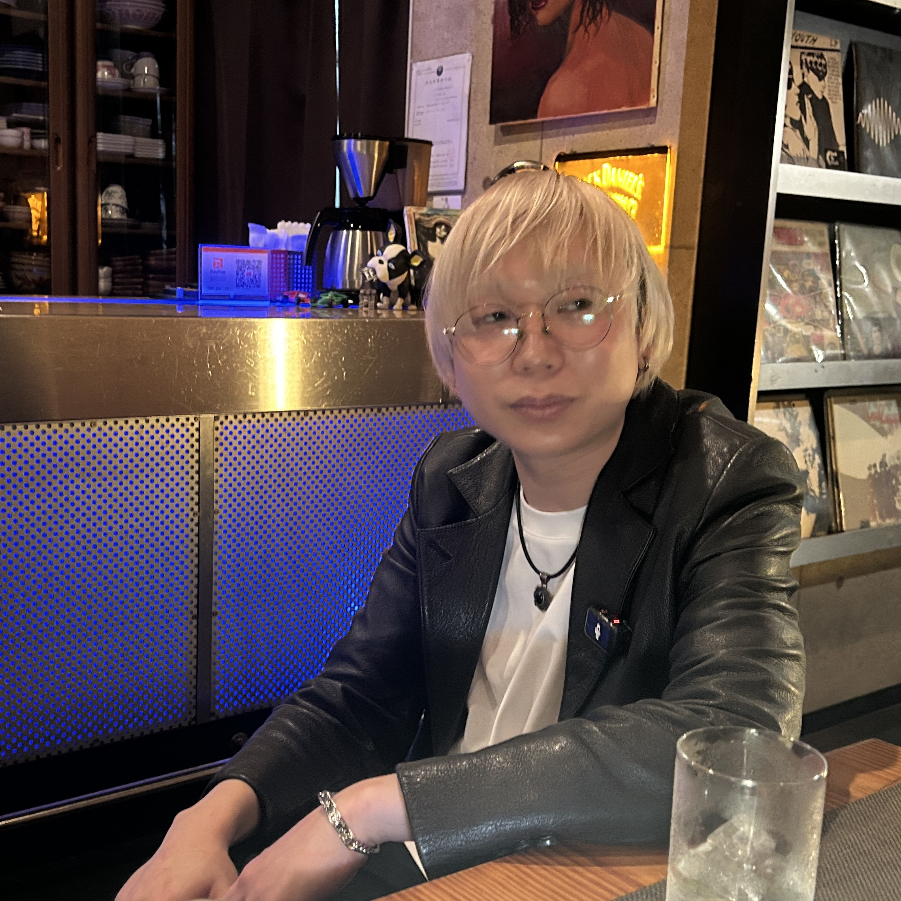

**さとレ：** キョウタさんは土浦のキーマンの一人だなと思って見てるんですけど。実際に住まれて何年ぐらいになるんですか？

**浦上キョウタ（以下キョウタ）：** もう店と同じ年ぐらいだと思うんで、9年ぐらいですか？

**さとレ：** 実際住んでみてどうですか？

**キョウタ：** 茨城、めっちゃ好きですよ。ほんとに生まれも育ちもずっと柏で、いろいろなこと見てきたんで。なんか、ちょっとひねくれてんのかわかんないですけど、いけ好かない部分もすぐ見えちゃって。好きな人いたら申し訳ないですけど、でも僕は茨城の方が好きだって絶対言える理由があって。

<!--more-->

---

**キョウタ：** 言い方変ですけど、みんないい意味で素直だと思う。考えてないとかって意味じゃないんです。すごくストレートに見てくれるから。なんかリスペクトがすごいあるのを感じられるから。土浦に来て、まずその雰囲気がすごく新鮮で。「なんか俺が求めてたのはこういう空気感だな」って思って。だから茨城のこの音楽シーンの土壌みたいなのを経験したときに、すごく感動しました。

**さとレ：** これは本当に、皆さん異口同音におっしゃるのが、特にツアーで来られてる方から「茨城の人たちはすごくあったかいよね」って。ステージ上から投げかけた時に反応してくれたり、やってる曲に手拍子してくれたりっていうのが、茨城はすごいって。

**キョウタ：** なんかすごく、気持ちが乗ってるなって思っていて。はっきり好きな人が来てくれてる感じというか。やっぱりこう、ちょっと東京とかだと、お客さんも自分を律しないとみたいなのが強くあると思うんですよね。そこを一回抜けて、素直に「好きです」って言える。そこにリスペクトがあるから、なんか別のカッコよさがありますよね、茨城の人たちに。

**さとレ：** 確かに。飾らなさっちゃ飾らなさですし。

**キョウタ：** どっちもいい。そして俺は茨城の方が好きだなって思うとこがあって、土浦にお店開けて嬉しいなと思う。マジで何も知らないできたんで、ここ。

---

**さとレ：** 8年間の間には、コロナの騒動があったりとか、社会的にも困難な状況がいろいろあったと思うんですけど。どうやって乗り越えてきたんですか？

**キョウタ：** もうそれはシンプルに「楽しく生きよう」です。今「急にポジティブかよ」って思ったかもしれないですけど、つまんないことしたくなくて。つまんないことしてる時間が一番辛くて、自分の中では。

**さとレ：** わかります。

**キョウタ：** ありがたいことに、うちは2年目でコロナだったんですよ。で、ありがたいっていうのが、給付金をちゃんといただける状態だったんで。だから負荷がかかることをしないようにしようと思って。コロナ禍で辞めちゃったりとか、ちょっと変わっちゃった人とかも僕見てきたんですよ。なんかそれって向き合いすぎたのかな、本気すぎた人なのかな、とか。自分もそうなっちゃうかもしれないなって当時思ってて。だからもうその時は「とにかく遊べる時間は遊ぶ」みたいな。楽しくしないと自分がおかしくなるなっていうのを強く感じた。

**さとレ：** 変な言い方で言うと、広い意味で真面目だなって思うんですよね。狭く真面目な人って、すごい頑張りすぎて折れちゃうタイプだと思うんですけど。生き物としてもっと真っ当に、って思うとやっぱり休むのも大切だし。どう楽しくやるかっていうのは、すごく真面目な問いだと僕は思っていて。

**キョウタ：** なんか嬉しいかもしれない。ちょうどこないだ久しぶりに会った先輩に「相変わらず真面目だな」って言われたばっかりなんですよ。

---

**さとレ：** キョウタさんは、あまりふざける印象って少ないかもですね。

**キョウタ：** えーマジっすか？ずーっとふざけてるんですけど（笑）。

**さとレ：** あの、基本姿勢がふざけてる人の特徴って、常に思ってないことを言うんですよ。冗談もそうだし、本気か冗談かわからないことを言うのもそうだし。「常に思ってなさそうなことを口に出し続ける」っていうのが、ふざけてる人のスタイルで。その視点でいくと、キョウタさんは割と真面目だなって。

**キョウタ：** まあ、そうですね。そう考えると自分はすごく真面目な流れで生きてる感じがします。真面目の源流がある。

それと、真面目とシリアスってちょっと違ったりすると思うんですよね。「面白い」にもいろいろあるじゃないですか。funnyとinterestingみたいな。で、絶妙なラインにしたくて。「知ってれば面白い」とかもそうですし、真面目なシリアスなものが壊れた時ってめっちゃ面白いじゃないですか。だから、真面目な僕がマジベロベロになってる時とか、多分超面白いと思うんですよ。面白さはずっと探求してたりはしますね。何が可笑しいんだろうなって。

---

**さとレ：** そもそもこういう生い立ちの話って、なかなかする機会ないですよね。

**キョウタ：** そうですね。「浦上キョウタです、よろしくお願いします。僕は0歳から3歳まで高円寺で育ち、そこから25歳ぐらいまでは柏で育った人間です」とか言わないですよね（笑）。

**さとレ：** なんかこう、ライブバーの転換の合間とかにちょっと喋る時って、全然そんな話にならないし。

**キョウタ：** なんかあと自己PRタイムみたいな感じですよね、ライブハウスって緊張感あるから。いかに自分の人間性を一言二言で見せるか、って思いません？「あ、この人好きだな」って思った時に、「この人に対してどうアプローチしよう」ってめっちゃ考えるんですよね。

さとレックスさんと今初対面だとしたら、ベースプレイを見ていてなんかすごくイギリス味を感じたりするかも、とか。ちょっとおかしいこと言っても大丈夫そうかな、とか。「そっちの方がこっちの気を引きそうだな」とか思って会話したりとか。だから転換の10分って、めっちゃ大事だと思うんですよ、ライブハウスって。みんな自分の名刺じゃないですけど、いかに自分を届けるかみたいな場所でもあると思っていて。

**さとレ：** なるほどな。ここまでの話聞いて、キョウタさんは戦略家だなってちょっと思いました。

---

**さとレ：** 僕はね、称賛したいなっていうのはあって。例えば相手が女の子だったりするじゃないですか。「急に話しかけてきて下心あるのかな」みたいなふうになっても申し訳ないんですけど、でも自分が賞賛することで、ちょっとでもその人にとって自信になることがあればいいなと思うし。極端に言ったら「もう誰からも認められないからやめちゃおっかな」って思ってる可能性すらあるじゃないですか。そこに「すっげーよかったです」っていうコメントを投じることによって、もしかしたらちょっと変わるかもしれないな、みたいな想像を勝手にするんですよね。

**キョウタ：** ちょっと自分の話に戻っちゃいますけど、あの自分がライブする人だとしたら、爪痕を残したいというか印象をつけたい。一言二言でなるべく済ませた方がスマートだとは思ってたんですけど……でもいいアーティストを見た時は僕もそれ一緒かもしれないです。伝えたいって思って、話せるんだったらやっぱりちょっと話したい。なるべく控えるようにはしてるんですけど、すごい感動したっていう気持ちに嘘はないし。丁寧に伝えられたら。

**さとレ：** 難しいですもんね、最近は。

**キョウタ：** 俺はもともとそういうの大切にしたい人間なんで。女の子に対して気を使うのもめっちゃわかる。うちのスタッフの美和ちゃん、hyuちゃんに対してもすごく気を使いながら話すので。

**さとレ：** 優しいですよね。

**キョウタ：** そこはなんか丁寧に接したいです。敬意を持って人と接したいです。

---

**さとレ：** 8年間ここでやられてる中で、その変遷というか、傾向が変わってきてるなみたいなのって思ったりすることありますか？

**キョウタ：** 傾向。ああ、変化は常に捉えていて。大きい流れではなくて、マイナーチェンジみたいなのが好きなんで。単純にめちゃくちゃ興味を持ってもらえるようになったから、どんどん対応していかないとなっていうのがあって。昔はどっちかっていうと自分で仕掛けていく感じだったんですけど、今はその来てくれる人たちに対してどう対応していくかみたいな方が大事なのかな、とか。

**さとレ：** フェーズが変わってきたというか。

**キョウタ：** そうですね。

*[第3話につづく](../03/)*
